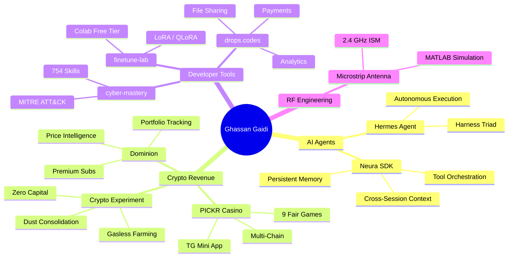
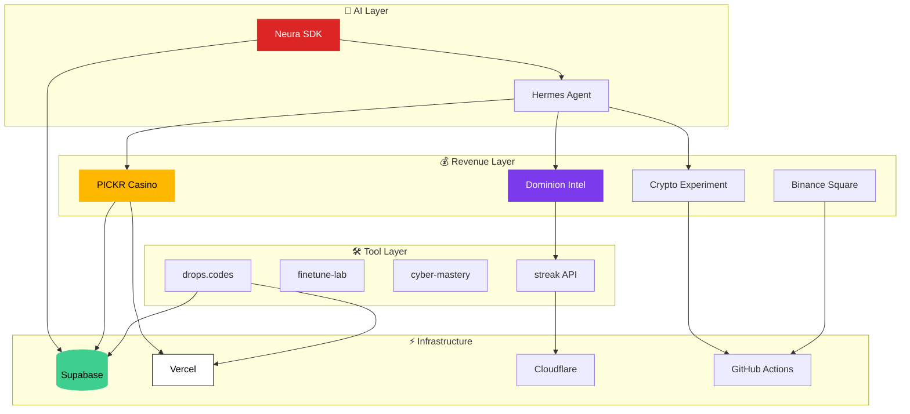

<div align="center">

<!-- ═══════════════════════════════════════════════════════════════
     ANIMATED HEADER
     ═══════════════════════════════════════════════════════════════ -->
<svg width="820" height="200" viewBox="0 0 820 200" xmlns="http://www.w3.org/2000/svg">
  <defs>
    <linearGradient id="g1" x1="0%" y1="0%" x2="100%" y2="0%">
      <stop offset="0%" stop-color="#DC2626">
        <animate attributeName="stop-color" values="#DC2626;#FFB800;#7C3AED;#DC2626" dur="6s" repeatCount="indefinite"/>
      </stop>
      <stop offset="50%" stop-color="#FFB800">
        <animate attributeName="stop-color" values="#FFB800;#7C3AED;#DC2626;#FFB800" dur="6s" repeatCount="indefinite"/>
      </stop>
      <stop offset="100%" stop-color="#7C3AED">
        <animate attributeName="stop-color" values="#7C3AED;#DC2626;#FFB800;#7C3AED" dur="6s" repeatCount="indefinite"/>
      </stop>
    </linearGradient>
    <linearGradient id="g2" x1="0%" y1="0%" x2="100%" y2="0%">
      <stop offset="0%" stop-color="#DC2626" stop-opacity="0"/>
      <stop offset="50%" stop-color="#DC2626" stop-opacity="1">
        <animate attributeName="offset" values="0.3;0.7;0.3" dur="3s" repeatCount="indefinite"/>
      </stop>
      <stop offset="100%" stop-color="#DC2626" stop-opacity="0"/>
    </linearGradient>
    <filter id="glow">
      <feGaussianBlur stdDeviation="3" result="blur"/>
      <feMerge><feMergeNode in="blur"/><feMergeNode in="SourceGraphic"/></feMerge>
    </filter>
    <filter id="glow-strong">
      <feGaussianBlur stdDeviation="6" result="blur"/>
      <feMerge><feMergeNode in="blur"/><feMergeNode in="SourceGraphic"/></feMerge>
    </filter>
    <clipPath id="text-clip">
      <text x="410" y="85" text-anchor="middle" font-family="Georgia, serif" font-size="72" font-weight="bold" fill="white">GHASSAN GAIDI</text>
    </clipPath>
  </defs>

  <!-- Background grid -->
  <g opacity="0.06">
    <line x1="0" y1="50" x2="820" y2="50" stroke="#DC2626" stroke-width="0.5"/>
    <line x1="0" y1="100" x2="820" y2="100" stroke="#DC2626" stroke-width="0.5"/>
    <line x1="0" y1="150" x2="820" y2="150" stroke="#DC2626" stroke-width="0.5"/>
    <line x1="200" y1="0" x2="200" y2="200" stroke="#DC2626" stroke-width="0.5"/>
    <line x1="410" y1="0" x2="410" y2="200" stroke="#DC2626" stroke-width="0.5"/>
    <line x1="620" y1="0" x2="620" y2="200" stroke="#DC2626" stroke-width="0.5"/>
  </g>

  <!-- Horizontal scan line -->
  <rect x="0" y="0" width="820" height="2" fill="url(#g2)" opacity="0.8">
    <animateTransform attributeName="transform" type="translate" values="0,0;0,200;0,0" dur="4s" repeatCount="indefinite"/>
  </rect>

  <!-- Name text with gradient fill -->
  <text x="410" y="85" text-anchor="middle" font-family="Georgia, serif" font-size="72" font-weight="bold" fill="url(#g1)" filter="url(#glow)">
    GHASSAN GAIDI
    <animate attributeName="opacity" values="0.9;1;0.9" dur="3s" repeatCount="indefinite"/>
  </text>

  <!-- Underline accent -->
  <line x1="210" y1="100" x2="610" y2="100" stroke="#DC2626" stroke-width="2" opacity="0.6">
    <animate attributeName="x1" values="410;210;410" dur="4s" repeatCount="indefinite"/>
    <animate attributeName="x2" values="410;610;410" dur="4s" repeatCount="indefinite"/>
  </line>

  <!-- Tagline with typing cursor -->
  <text x="410" y="135" text-anchor="middle" font-family="'Courier New', monospace" font-size="18" fill="#9ca3af">
    <tspan>autonomous systems</tspan>
    <tspan fill="#DC2626" opacity="0">
      <animate attributeName="opacity" values="1;0" dur="0.8s" repeatCount="indefinite"/>|
    </tspan>
  </text>

  <!-- Floating particles -->
  <circle cx="100" cy="30" r="1.5" fill="#DC2626" opacity="0.6">
    <animate attributeName="cy" values="30;170;30" dur="7s" repeatCount="indefinite"/>
    <animate attributeName="opacity" values="0.6;0.2;0.6" dur="7s" repeatCount="indefinite"/>
  </circle>
  <circle cx="300" cy="180" r="1" fill="#FFB800" opacity="0.4">
    <animate attributeName="cy" values="180;20;180" dur="9s" repeatCount="indefinite"/>
  </circle>
  <circle cx="520" cy="20" r="1.5" fill="#7C3AED" opacity="0.5">
    <animate attributeName="cy" values="20;180;20" dur="6s" repeatCount="indefinite"/>
  </circle>
  <circle cx="700" cy="160" r="1" fill="#DC2626" opacity="0.3">
    <animate attributeName="cy" values="160;40;160" dur="8s" repeatCount="indefinite"/>
  </circle>
  <circle cx="150" cy="100" r="0.8" fill="#FFB800" opacity="0.3">
    <animate attributeName="cx" values="150;670;150" dur="12s" repeatCount="indefinite"/>
  </circle>
</svg>

<!-- Badges -->
[](https://github.com/ghassan-gaidi)
[](https://ghassan.tech)
[](https://www.npmjs.com/package/neura-api)
[](https://pypi.org/project/neura-api/)

</div>

---

<!-- ═══════════════════════════════════════════════════════════════
     WHAT I BUILD — MERMAID MIND MAP
     ═══════════════════════════════════════════════════════════════ -->

<div align="center">

### `> what_i_build --verbose`

</div>



---

<!-- ═══════════════════════════════════════════════════════════════
     FEATURED PROJECTS — BENTO GRID
     ═══════════════════════════════════════════════════════════════ -->

<div align="center">

### `> featured_projects --layout=bento`

</div>

<table>
<tr>
<td width="50%" valign="top" style="border: 1px solid #1a1a2e; border-radius: 0px; padding: 16px; background: #0d0d14;">

#### 🟢 [Neura](https://github.com/ghassan-gaidi/neura)
> AI agent backend and SDK — the external brain layer for autonomous agents

```
 persistent_memory  │  tool_orchestration  │  cross_session_context
```

[](https://neura-blond.vercel.app)
[](https://www.npmjs.com/package/neura-api)
[](https://pypi.org/project/neura-api/)

`Next.js` `Supabase` `TypeScript` `Python`

</td>
<td width="50%" valign="top" style="border: 1px solid #1a1a2e; border-radius: 0px; padding: 16px; background: #0d0d14;">

#### 🟢 [drops.codes](https://github.com/ghassan-gaidi/drops.codes)
> File sharing platform — upload, share, track, and monetize

```
 upload  │  share  │  analytics  │  payments
```

[](https://dropscodes.vercel.app)

`Next.js 16` `Supabase` `Dodo Payments`

</td>
</tr>
<tr>
<td width="50%" valign="top" style="border: 1px solid #1a1a2e; border-radius: 0px; padding: 16px; background: #0d0d14;">

#### 🟢 [finetune-lab](https://github.com/ghassan-gaidi/finetune-lab)
> Fine-tuning LLMs on Google Colab free tier — no paid GPUs required

```
 lora  │  qlora  │  notebooks  │  trl
```

`Python` `Colab` `Hugging Face` `TRL`

</td>
<td width="50%" valign="top" style="border: 1px solid #1a1a2e; border-radius: 0px; padding: 16px; background: #0d0d14;">

#### 🟢 [cyber-mastery](https://github.com/ghassan-gaidi/cyber-mastery)
> 754 curated cybersecurity skills + 14 synthesis reference docs

```
 offensive  │  defensive  │  architectural  │  mit
```

`Security` `MITRE ATT&CK` `MIT License`

</td>
</tr>
<tr>
<td width="50%" valign="top" style="border: 1px solid #1a1a2e; border-radius: 0px; padding: 16px; background: #0d0d14;">

#### 🟢 [streak](https://github.com/ghassan-gaidi/streak)
> Real-time crypto price feeds and market data API

```
 coingecko  │  websocket  │  caching  │  rest
```

`Python` `CoinGecko` `API`

</td>
<td width="50%" valign="top" style="border: 1px solid #1a1a2e; border-radius: 0px; padding: 16px; background: #0d0d14;">

#### 🟢 [antenna](https://github.com/ghassan-gaidi/microstrip-patch-antenna-2.4ghz-matlab)
> 2.4 GHz microstrip patch antenna — FR4 substrate, full RF characterization

```
 matlab  │  radiation_pattern  │  s_parameters  │  gain
```

`MATLAB` `RF` `ISM Band`

</td>
</tr>
<tr>
<td width="50%" valign="top" style="border: 1px solid #1a1a2e; border-radius: 0px; padding: 16px; background: #0d0d14;">

#### 🔒 [PICKR](https://t.me/cr00k_bot)
> Multi-chain crypto casino on Telegram — 9 provably fair games

```
 eth  │  sol  │  ton  │  mini_app
```

[](https://t.me/cr00k_bot)

`TypeScript` `grammY` `Supabase`

</td>
<td width="50%" valign="top" style="border: 1px solid #1a1a2e; border-radius: 0px; padding: 16px; background: #0d0d14;">

#### 🔒 [Dominion](https://crypto-empire-ten.vercel.app)
> Crypto intelligence dashboard + Telegram bot — premium features

```
 prices  │  portfolio  │  alerts  │  premium
```

[](https://crypto-empire-ten.vercel.app)
[](https://t.me/Crypt0Emp1reBot)

`Flask` `CoinGecko` `Polar.sh`

</td>
</tr>
<tr>
<td width="50%" valign="top" style="border: 1px solid #1a1a2e; border-radius: 0px; padding: 16px; background: #0d0d14;">

#### 🔒 [Crypto Experiment](https://github.com/ghassan-gaidi/crypto-experiment)
> Autonomous gasless revenue pipeline — zero capital required

```
 quest_farming  │  testnet  │  dust_consolidation  │  gasless
```

`Python` `Ethereum` `GitHub Actions`

</td>
<td width="50%" valign="top" style="border: 1px solid #1a1a2e; border-radius: 0px; padding: 16px; background: #0d0d14;">

#### 🔒 [Binance Square](https://github.com/ghassan-gaidi/binance-square-portal)
> Autonomous crypto content engine — write once, publish everywhere

```
 write  │  schedule  │  analytics  │  tg_bot
```

`React` `Python` `Binance` `Telegram`

</td>
</tr>
</table>

---

<!-- ═══════════════════════════════════════════════════════════════
     ARCHITECTURE DIAGRAM — MERMAID
     ═══════════════════════════════════════════════════════════════ -->

<div align="center">

### `> system_architecture --depth=full`

</div>



---

<!-- ═══════════════════════════════════════════════════════════════
     TECH STACK — ANIMATED SVG BARS
     ═══════════════════════════════════════════════════════════════ -->

<div align="center">

### `> tech_stack --format=visual`

</div>

<table>
<tr>
<td width="33%" valign="top" style="border: 1px solid #1a1a2e; padding: 14px; background: #0d0d14;">

**Languages**
<br/>

`Python` `TypeScript` `JavaScript` `Solidity` `MATLAB`

**Frameworks**
<br/>

`Next.js 16` `React 18` `Flask 3.0` `Vite` `grammY`

</td>
<td width="33%" valign="top" style="border: 1px solid #1a1a2e; padding: 14px; background: #0d0d14;">

**Infra & DB**
<br/>

`Supabase` `Vercel` `Cloudflare` `GitHub Actions`

**Blockchain**
<br/>

`Ethereum` `Base` `Arbitrum` `Polygon` `TON` `Solana`

</td>
<td width="33%" valign="top" style="border: 1px solid #1a1a2e; padding: 14px; background: #0d0d14;">

**AI / ML**
<br/>

`LLM Agents` `LoRA` `QLoRA` `TRL` `RAG`

**Payments & SDK**
<br/>

`Base USDC` `Dodo` `Polar.sh` `npm` `PyPI`

</td>
</tr>
</table>

---

<div align="center">

### `> github_stats --verbose`


</div>

---

<!-- ═══════════════════════════════════════════════════════════════
     TERMINAL FOOTER
     ═══════════════════════════════════════════════════════════════ -->

<div align="center">

<svg width="500" height="90" viewBox="0 0 500 90" xmlns="http://www.w3.org/2000/svg">
  <defs>
    <linearGradient id="line-g" x1="0%" y1="0%" x2="100%" y2="0%">
      <stop offset="0%" stop-color="#DC2626" stop-opacity="0"/>
      <stop offset="50%" stop-color="#DC2626" stop-opacity="1"/>
      <stop offset="100%" stop-color="#DC2626" stop-opacity="0"/>
    </linearGradient>
  </defs>
  <line x1="50" y1="10" x2="450" y2="10" stroke="url(#line-g)" stroke-width="1"/>
  <text x="250" y="40" text-anchor="middle" font-family="'Courier New', monospace" font-size="14" fill="#6b7280">
    <tspan fill="#DC2626">$</tspan> whoami
  </text>
  <text x="250" y="58" text-anchor="middle" font-family="'Courier New', monospace" font-size="13" fill="#9ca3af">
    builder · autodidact · systems thinker
  </text>
  <text x="250" y="78" text-anchor="middle" font-family="'Courier New', monospace" font-size="11" fill="#4b5563">
    leo2574@proton.me · t.me/le0Fvlc0 · ghassan.tech
  </text>
</svg>

</div>
